# TikTok Community

**TikTok Community** is a social media application combining features from both Twitter and TikTok. Users can post short videos, interact through likes and comments, and follow other users in a dynamic feed. The app is built using **Kotlin** with a **Firebase** backend and a **Material UI** frontend for a smooth and responsive user experience.

## Features

- **User Authentication**: Sign up and login with Firebase Authentication.
- **Post Videos**: Upload and share short videos.
- **Follow/Unfollow**: Stay updated with other users’ content by following them.
- **Like & Comment**: Engage with the community by liking and commenting on posts.
- **Real-time Updates**: Firebase enables real-time updates for the feed, likes, and comments.
- **Material UI**: Clean and intuitive interface designed with Material UI.

## Tech Stack

- **Frontend**: Material UI for clean, modern interface components.
- **Backend**: Firebase Authentication, Firestore for data storage, and Firebase Storage for video uploads.
- **Language**: Kotlin
- **Build Tools**: Gradle

## Screenshots
<p float="left">
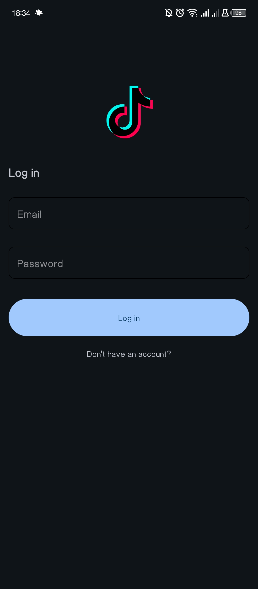
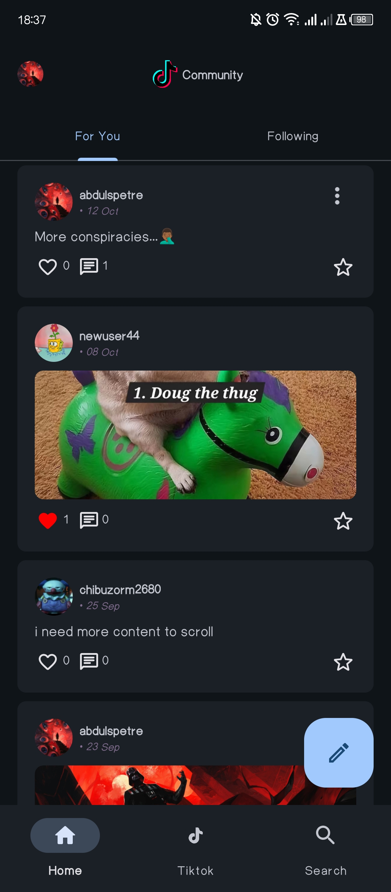
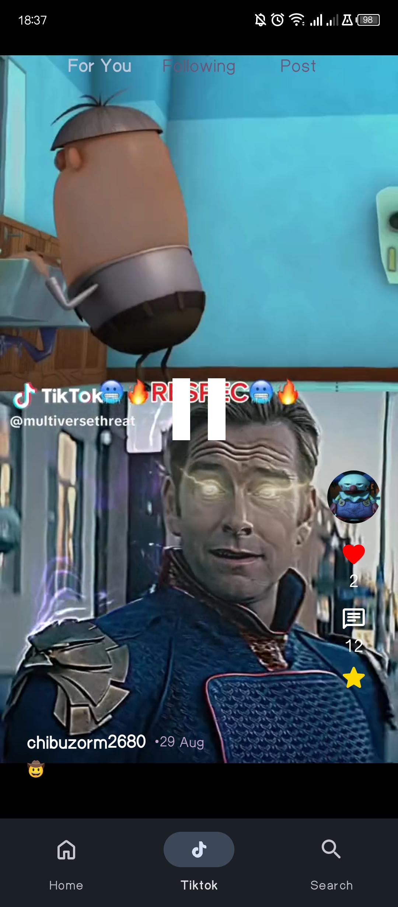
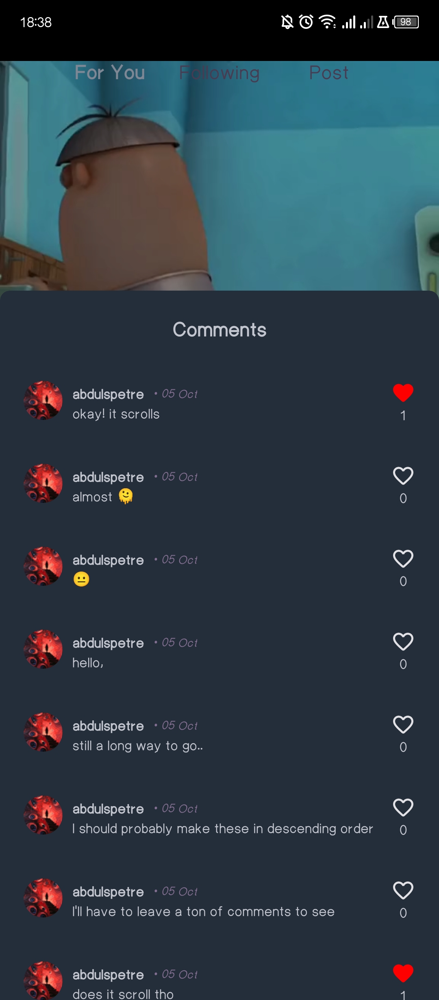
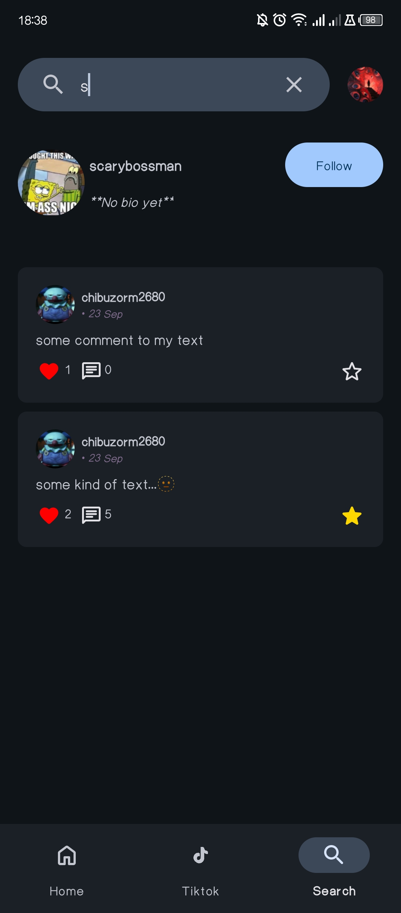
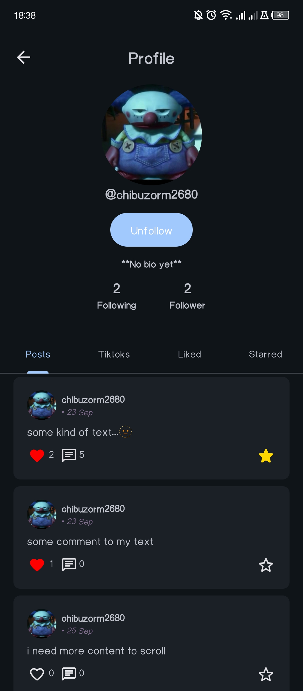
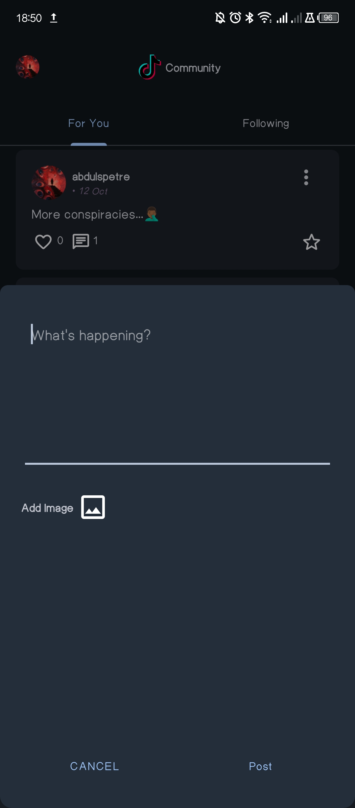
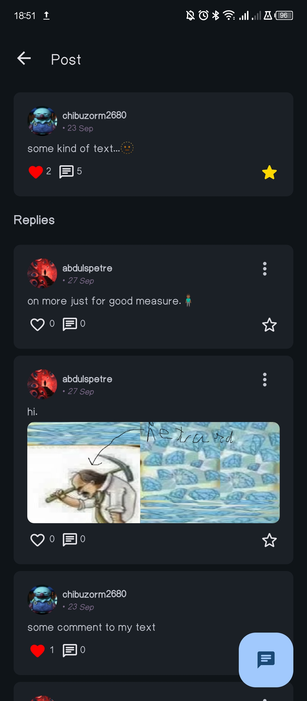
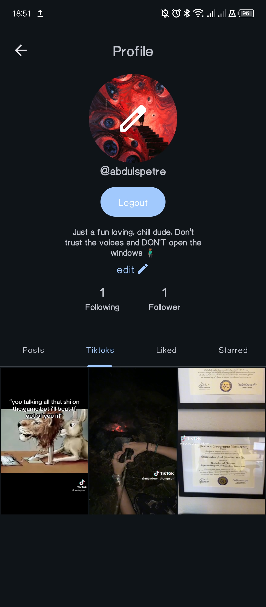
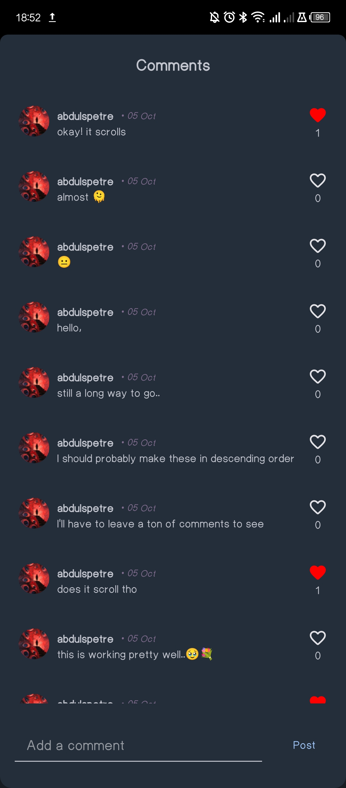
</p>

## Material UI dynamic theming based on the device colors
<p float="left">

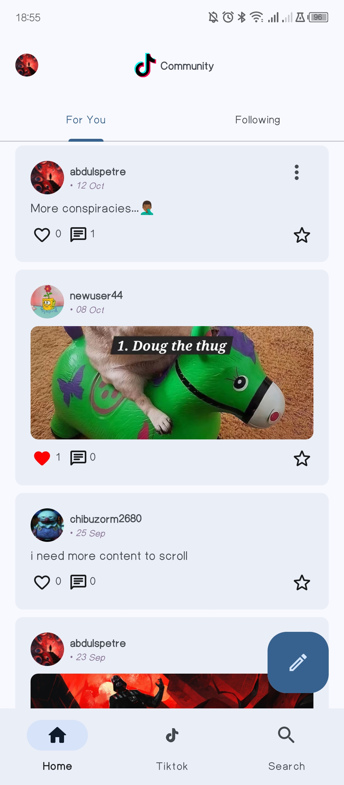
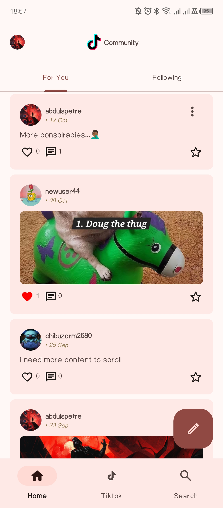
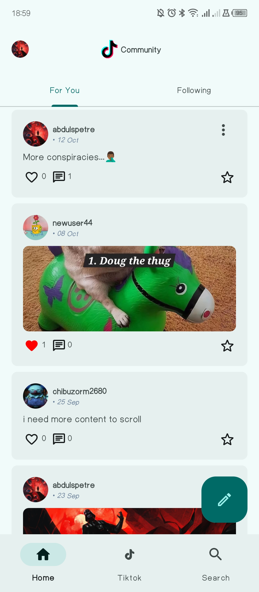
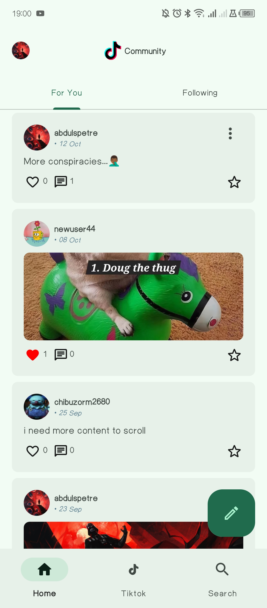
</p>
## Installation

1. Clone the repository:
   ```bash
   git clone https://github.com/thechibuzor1/Tiktok-Community.git
   ```

2. Open the project in **Android Studio**.

3. Set up Firebase for your project:
   - Create a new Firebase project in the [Firebase Console](https://console.firebase.google.com/).
   - Add your Android app to the Firebase project.
   - Download the `google-services.json` file and place it in your `app` directory.
   - Enable Firebase Authentication, Firestore, and Firebase Storage.

4. Sync the project with Gradle.

5. Run the app on an emulator or connected device.

## Contributing

Contributions, issues, and feature requests are welcome! Feel free to check the [issues page](https://github.com/thechibuzor1/Tiktok-Community/issues) for open tasks.

## License

This project is licensed under the MIT License. See the [LICENSE](./LICENSE) file for details.

 
